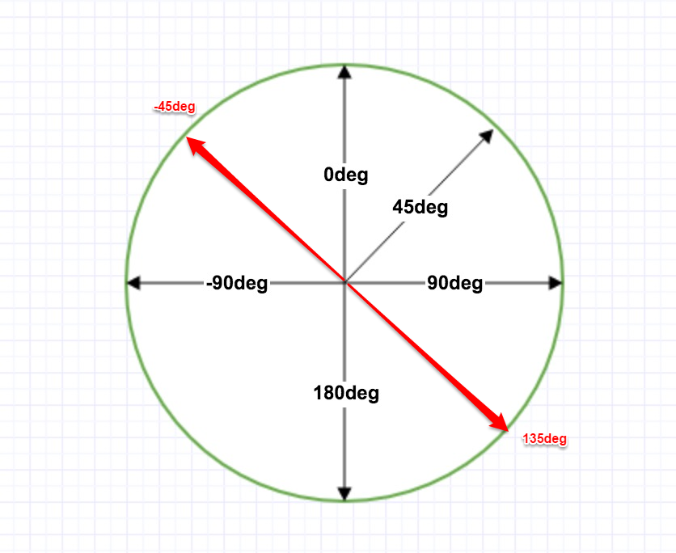
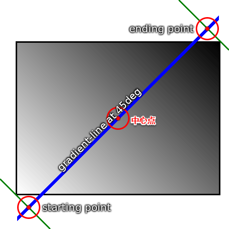
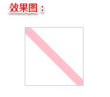
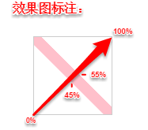
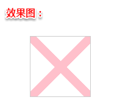
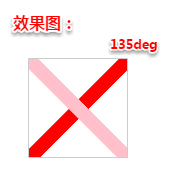
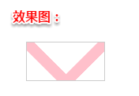
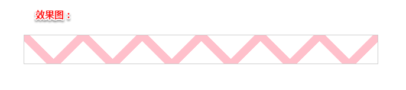

# linear-gradient 深度理解之波浪下划线
 
> 用 linear-gradient ( deg, color percentage/length, color percentage/length...) 的时候搞不清楚起始点和数值位置的童鞋应该有很多，我也是写过好几个有趣的例子之后彻底理解了，这里总结一下。

## 知识点一
首先要记住的是（图1），要 知道角度对应的是渐变从起点到终点的方向，和我们数学中的坐标系不一样。（图1取自菜鸟教程里的示意图）

图1 - 线性渐变角度示意图

## 知识点二
然后就要理解（图2），这里我们把矩形的垂直中心点称为中心点，在做渐变的时候要先找到这个点，以这个点为梯度线（gradient-line）的中点，把对应的角度线画好，确定渐变的起点（starting point）和终点（ending point），这个看图会比较好理解。由于这个实例图是矩形，所以起点和终点在矩形外（找到距梯度线最近的两个顶角，然后从顶角做梯度线的垂线， 相交的点即为起点/终点），如果是正方形，即为顶点。（图2取自官方规范的示意图）

图2 - 线性渐变角度坐标与位置关系图

> 理解了这几个点，我们就能很好的理解 percentage/length 了，百分比和长度值都是在这条梯度线上，记得从起点开始哦。

## 实例
### 第一步

html：
`

`

css:

    .box{
        width: 100px;
        height: 100px;
        background: linear-gradient(45deg, transparent 0%, transparent 45%, pink 45%, pink 55%，transparent 55%, transparent 100%);
        background-size: 100px 100px;
        border: 1px solid #ccc;
    }

 

对照之前讲的两幅图和标注，看下自己理解了没，下面要开始升级了。

### 第二步

我们再增加一个线性渐变，把 background 换成下面的这行：

    background: linear-gradient(45deg, transparent 0%, transparent 45%, pink 45%, pink 55%, transparent 55%, transparent 100%), linear-gradient(135deg, transparent 0%, transparent 45%, pink 45%, pink 55%, transparent 55%, transparent 100%);

这里要注意的是，利用逗号可以写很多渐变，并且会相互叠加，但是前面的会在最上面，如上个例子，45deg的线会覆盖在135deg上面（透明 transparent 让135deg 的部分显示）：

### 第三步

回归正题，下一步我们将 height设为50px，大家应该都能猜到形成的效果吧：

### 第四步

最后形成波浪，改变宽度即可，因为background-repeat默认是repeat，也就是重复啦：

### 彩蛋 —— 波浪下划线文本实现

html:
`桃李不言下自成蹊`

css:

    .text {
        position: relative;
        font-size: 20px;
        color: #3c3c3c;
        padding-bottom: 5px;
    }
    .text:after {
        content: '';
        display: block;
        position: absolute;
        top: 100%;
        left: 0;
        width: 100%;
        height: 10px;
        background: linear-gradient(135deg, transparent, transparent 45%, pink, transparent 55%, transparent 100%), linear-gradient(45deg, transparent, transparent 45%, pink, transparent 55%, transparent 100%);
        background-size: 20px 20px;
    }

这个效果是可以根据内容增长而增长的波浪下划线哦~

